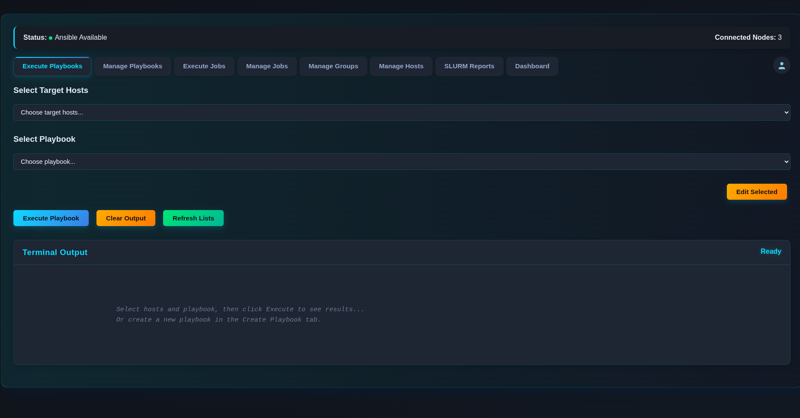
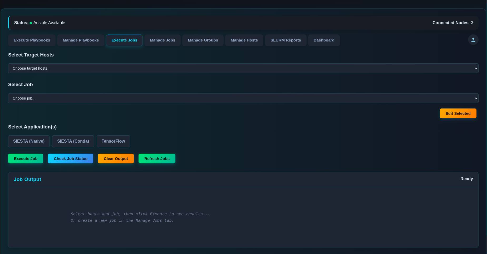

# Ansible Flask WebApp

🚀 **Modern Web Interface for Ansible Automation & SLURM Job Management**

A comprehensive web platform that simplifies infrastructure automation through an intuitive interface. Built for system administrators, DevOps engineers, and researchers who need to manage multiple hosts, execute complex playbooks, and orchestrate SLURM-based computational workflows.

## ✨ Key Features

**Ansible Management**
- Playbook execution across multiple hosts with real-time output
- Dynamic inventory management with host and group support
- Role-based access for secure multi-user environments
- Live execution status and detailed logging

**SLURM Integration**
- Job orchestration and monitoring through the web interface
- Application manifests for TensorFlow and SIESTA
- Resource monitoring and execution reports
- Automated environment management with Conda

**Enterprise Features**
- User authentication and session management
- Admin dashboard for user and permission management
- Audit trails and reporting
- Multi-tenant architecture with isolated workspaces

*Playbook management interface showing real-time execution monitoring*

*SLURM job execution with application selection and status tracking*

## 🛠️ Technology Stack

**Backend**
- Python 3.8+ with Flask
- SQLAlchemy ORM for database operations
- MariaDB for persistent data storage
- SLURM integration for job scheduling

**Frontend**
- Modern CSS3 with a custom dark theme
- Vanilla JavaScript for dynamic interactions
- Responsive design optimized for desktop and tablet use

**Infrastructure**
- Ansible Engine for automation execution
- SLURM Workload Manager for job scheduling
- Conda/Miniforge for environment management
- NFS shared storage for distributed file access

## 📦 Included Playbooks & SLURM Job Scripts

**Ansible Playbooks** (playbooks folder):
- System: user creation, deletion, renaming
- Infrastructure: SLURM controller and compute node setup, webserver configuration, backup
- Audit and monitoring: passwordless checks, listening ports, uptime, performance metrics
- Miscellaneous: directory creation, index updates, and more

**SLURM Job Scripts** (slurm_jobs folder):
- Examples and tests: generic job scripts, MPI tests, information collection
- Scientific jobs: SIESTA jobs for various systems, including Conda-based runs
- Multi-application and TensorFlow jobs
- Additional scripts for testing and management